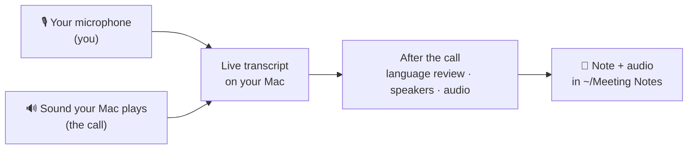

# Wingman (beta)

**Meeting transcripts that never leave your Mac.**

Wingman is a small Mac app that lives in your menu bar. When a Teams, Zoom, Google
Meet or other browser call starts, it asks whether to record (or records automatically, if you
choose). You see a live transcript while people talk, and when the call ends it saves
the full transcript — with who said what — plus the audio. Everything happens on your
Mac: no account, no cloud, and no bot joining your meeting. It's free and
[open source](#license).

*Wingman writes transcripts, not summaries (yet).*

> **This is an early beta by Daniel Wing.** I use it every day for my own meetings,
> but it will have rough edges. Please tell me what breaks and what's missing.
>
> **[Install](#install) · [Send feedback](#feedback) · [How it works](#how-it-works)**

**En español:** Wingman graba y transcribe tus llamadas de Teams, Zoom, Google Meet o del navegador
en tu Mac, sin nube. Entiende español e inglés mezclados. Puedes enviar tus
comentarios en español. Si tu Mac está en español, los botones de la instalación se
llaman *Configuración del Sistema* (o *Ajustes del Sistema*) → *Privacidad y
seguridad* → *Abrir igualmente*; no elijas *trasladar a la papelera*. Tu calendario del
trabajo (Outlook / Microsoft 365) funciona sin iniciar sesión en Microsoft desde Wingman:
agrega la cuenta en *Cuentas de internet* de la Mac (opción *Microsoft Exchange*) y
Wingman la lee desde la app Calendario ([pasos](#connect-your-work-calendar)).

---

## What it does

- **Starts with your calls.** When Microsoft Teams, Zoom, Google Meet or another call in
  your browser starts using the microphone, Wingman asks whether to record it — or
  records automatically, or ignores it; you choose per app. Recording stops when the
  call ends. ([How Google Meet is recognized](#google-meet).)
- **Live transcript.** Read along as people talk. English and Spanish can be mixed in
  the same meeting, even in the same sentence ("vamos a revisar el *dashboard* de
  Power BI"). Portuguese has had some testing; French, German and Italian are
  available but untested.
- **Knows who said what.** Your microphone is **Me**; after the call, the other side
  is split into **Them 1, Them 2…**. Click a name to rename it. If you turn on
  *Recognize people* (experimental), Wingman learns voices you've named and recognizes
  those people in later meetings.
- **Uses your calendar — no Microsoft sign-in.** Wingman reads the Mac's own Calendar
  app, so your Outlook / Microsoft 365 work calendar works even if your company doesn't
  let apps like this connect to your Microsoft account: add the account to your Mac once
  ([how](#connect-your-work-calendar)). The current meeting's title becomes the note's
  name, and the organizer, invitees and meeting link go in the note. Invitees are one click away when
  naming speakers. Two meetings at the same time? Wingman picks the one you organized
  (or the first by name), and the calendar button next to the name switches it.
- **Follows your mute** (optional). Mute yourself in the Teams or Zoom app (button,
  shortcut or AirPods) and Wingman stops transcribing you too, so a word to someone next
  to you doesn't end up in the notes. Want to add a comment for yourself while muted?
  Click **Transcribe me anyway**.
- **Saves plain files you own.** A text note (`.md`, opens in TextEdit or any notes app)
  and the meeting's audio (about 45 MB per hour), in a folder you can open, search and
  back up. Subtitles (`.vtt` / `.srt`) on request. Short on space? Wingman can move audio
  older than a month, or past a size you choose, to the Trash; your notes stay.
- **Transcribes recordings too.** Drag a recording or video onto Wingman's window, or
  use menu bar → **Transcribe a Recording…**

## How it works

**1. Two separate ears.** Wingman listens to your microphone and, separately, to the
sound your Mac plays — the other side of the call. Keeping them apart is what lets it
label your words as yours and hear the others clearly. The call audio comes from
macOS's own audio capture: nothing is installed in your system and nothing joins the
meeting. While it records, Wingman hears *everything* your Mac plays, not just the
call, so pause music and videos during meetings.

**2. A live transcript.** A small speech detector splits the audio wherever someone
pauses, and each piece is transcribed on your Mac's Neural Engine by
[Parakeet](https://huggingface.co/moondream/parakeet-ultra), a fast speech model that
switches languages on its own. The line you see updates about once a second and
settles when the speaker pauses.

**3. A careful look after the call.** When the call ends, Wingman usually takes under a
minute to tidy up:

- **Language review.** Lines the live model was unsure about, or that came out in a
  language you haven't selected, are transcribed again from their audio by
  [Whisper](https://github.com/openai/whisper) — a larger, slower model — one line at a
  time, so each line gets its own language. Your *main language* settles the cases
  that could go either way. Lines of one or two words are left as they are.
- **Who spoke.** The call audio is split into individual voices, so "Them" becomes
  "Them 1", "Them 2"… With *Recognize people* on, people you've named before are
  suggested or named automatically.
- **Echo clean-up.** On laptop speakers your microphone also hears the call. A line of
  yours that clearly repeats theirs, word for word and right after it, is removed; one
  that's only similar (*"We should **not** deploy today"*) is kept and marked *(possible
  echo)*, so a real reply is never lost. With headphones nothing is filtered.
- **The audio:** one file with both sides mixed, to play back any moment, plus your voice
  and the call as separate tracks.

**4. A note you own.** Everything ends up in `~/Meeting Notes/<date>/` as a text file
(title, date, calendar details, the transcript with speakers and timestamps) plus the
audio. Lines the model wasn't confident about are marked *(unclear)*.

### Privacy

- **Everything runs on your Mac.** Audio, transcripts and voiceprints never leave it.
  There is no account, no analytics and no telemetry.
- **Wingman goes online only to download its speech models**, once, right after setup,
  from Hugging Face (`huggingface.co` must be reachable — some work networks block it):
  about 0.6 GB for live transcription, 1.5 GB for the language review and a few MB for
  voice detection and telling voices apart. If the review model can't be used, macOS may
  download its own speech files from Apple instead. After that, Wingman works offline.
- **…and to check for updates**, about once a day: it reads a small file attached to this
  page's latest release and, when there's a new version, downloads it from here
  ([updates](#updates)). Settings → About → *Install updates automatically* turns that off.
- **Feedback is up to you.** "Send Feedback…" opens a form in your browser; you see
  everything and send it yourself.
- **Your files stay private.** When Wingman creates `~/Meeting Notes`, only your user
  account can open it. Wingman's log (`~/Library/Logs/Wingman/wingman.log`) records what
  the app did — devices, permissions, timings, your Mac's model and macOS version, and for
  Google Meet only whether it found a call (never tab titles or meeting links) — never
  audio or what was said. It does include your audio devices' names (like "Ana's AirPods").
- **Audio is only kept if you want it.** To transcribe a meeting Wingman records its audio
  while it lasts. With *Save meeting audio* off, that audio sits in a private folder
  (`~/Library/Caches/Wingman`) and is deleted once the note is saved, or at the next
  launch if Wingman was stopped mid-meeting.
- **Voiceprints are kept only if you turn on *Recognize people***, and only on your Mac.

### Please record responsibly

Let people know you're recording. In many places it's required by law to get
everyone's consent before recording a conversation — and if you use *Recognize
people*, some places also require consent to keep someone's voiceprint.

---

## Requirements

- A Mac with **Apple silicon** (M1 or later) — Apple menu → *About This Mac* shows the chip
- **macOS 26 Tahoe** or later
- About **4 GB** of free space for the speech models, plus room for your recordings
  (about 45 MB per hour of meetings)
- Optional: your calendar in the Mac's **Calendar** app, to name meetings
  ([work calendars](#connect-your-work-calendar))
- Works with **Microsoft Teams** (the new app), **Zoom**, and **Google Meet** in Chrome or
  the Google Meet app. Edge, Brave, Arc and Opera recognize Meet the same way but have
  had less testing; in Safari and Firefox, Meet counts as a browser call. Other calls in
  a browser (Teams on the web…) are detected too, but have had little testing so far.
- The app is in English; meetings can be in English, Spanish and the other languages above.

## Install

1. Open the [latest release](https://github.com/daniel-wing/wingman-beta/releases/latest)
   and, under **Assets**, click the **Wingman-….zip** file (not *Source code*, which is
   Wingman's code — see [License](#license)).
2. Open your **Downloads** folder. If you already see the Wingman app, your browser
   unzipped it for you; otherwise double-click the zip. Drag **Wingman** into
   **Applications**.
3. Double-click Wingman in Applications. macOS says *"Wingman" Not Opened*. That's
   expected for this beta: click **Done** (not *Move to Trash*).
4. Open **System Settings → Privacy & Security**, scroll down to **Security**, and click
   **Open Anyway** next to *"Wingman" was blocked*. Confirm with your password or Touch
   ID, and click **Open Anyway** once more if macOS asks again. The button is only there
   for a while after step 3, so do this right away.
5. A short welcome guide explains each permission before macOS asks for it. When you
   finish it, the guide closes and Wingman moves to the menu bar (see
   [Where is Wingman?](#where-is-wingman)). It then downloads its speech models (about
   2 GB, once): click its menu-bar icon to see *Downloading…*. When that line is gone,
   Wingman is ready — give it a few minutes before your first call.

> **Why does macOS warn?** Apple *notarizes* apps from paid developer accounts. This
> beta isn't notarized yet, so macOS asks you to confirm — only do that for apps from
> people you trust. Prefer the Terminal? This replaces steps 3–4:
> `xattr -dr com.apple.quarantine /Applications/Wingman.app`
>
> **Work Mac?** If your company manages your Mac, *Open Anyway* or the audio
> permissions may be blocked or need your IT team.

### Updates

From version 0.8.0 on, Wingman keeps itself up to date. About once a day it checks this
page's latest release; when there's a new version, it downloads it in the background
and installs it the next time Wingman quits or your Mac restarts — or right away with
**Restart to Install Wingman …** in its menu. It never interrupts a recording. Updates
are checked against the project's signature, so only versions published here install,
and they don't need *Open Anyway*. To check yourself: menu bar icon → **Check for
Updates…**; to switch it off: Settings → About.

Still on 0.7.0? Install the latest version by hand once (the steps above); updates are
automatic after that.

### Connect your work calendar

Wingman **never asks you to sign in to Microsoft or Google**. It reads the calendars in
the Mac's own **Calendar** app. Many companies don't let apps like Wingman connect to
their Microsoft 365 accounts but do allow the Mac's Calendar, so this is the way to get
your work meetings into Wingman:

1. Open **System Settings → Internet Accounts → Add Account…** and choose **Microsoft
   Exchange** (Outlook / Microsoft 365) — or **Google** for Google Calendar. Wingman can
   open this page for you: Settings → Calendar → *Add a Work Calendar to Your Mac…*
2. Enter your work email and sign in on Microsoft's page, the same as in Outlook. Turn on
   **Calendars** (Mail, Contacts and the rest are up to you).
3. Open the **Calendar** app and check that today's meetings are there. The first sync
   can take a minute.
4. In Wingman, allow **Calendar** (in the welcome guide, or Settings → Calendar). That's
   it: Wingman now names your meetings and lists who was invited.

If your company blocks this too, Wingman works just the same; your notes are named by
time instead of by meeting. Wingman only reads your calendar: it never sees your
Microsoft password and never changes anything.

**Keep Wingman running:** it only notices calls while it's open. To start it with your
Mac, open System Settings → General → Login Items & Extensions, click **+** under
*Open at Login*, and choose Wingman.

**Updating:** new versions appear on the
[Releases page](https://github.com/daniel-wing/wingman-beta/releases) (click
**Watch → Custom → Releases** above to get an email). Quit Wingman (menu bar icon →
Quit Wingman), download the new zip, replace Wingman in Applications and open it.
macOS blocks each new version once, so repeat steps 3–4. Your notes, settings and
permissions stay.

### Where is Wingman?

After setup, Wingman lives in the **menu bar** at the top of the screen, near the
clock: a small **W** made of audio bars, which turns into a record symbol while
recording. It has no Dock icon unless its window is open. On MacBooks with a notch, a full menu bar can
hide the icon behind the camera — open Wingman again from Spotlight (⌘-Space, type
*Wingman*) and its window opens with the same controls.

### Permissions

| Permission | Why | |
|---|---|---|
| System audio | Hears the other people on the call. macOS lists it under *Screen & System Audio Recording*, but Wingman records sound only, never your screen. | Needed |
| Microphone | Hears you | Needed |
| Notifications | Asks *Record this call?* and shows a Stop button. Without it, Wingman opens its window instead. | Recommended |
| Calendar | Names meetings and lists invitees. Only reads, from the calendars in the Mac's Calendar app — no Microsoft or Google sign-in ([work calendar](#connect-your-work-calendar)). | Optional |
| Accessibility | To tell a Google Meet call from other browser use: it reads Chrome's tab titles and address bar ([how](#google-meet)). And to follow your mute in the Teams or Zoom app: it reads their mute button (and asks Teams to make it readable). It never clicks or types, and saves nothing it reads. | Optional; needed for Google Meet |

**Clicked "Don't Allow"?** System Settings → Privacy & Security → Microphone (or Screen
& System Audio Recording → *System Audio Recording Only*) → switch Wingman on.

## Using Wingman

- **Calls:** by default, a notification asks *Teams call detected — Record and
  transcribe this call?* Click **Record**. So you don't miss it, set System Settings →
  Notifications → Wingman → Alert Style to **Persistent**. (Wingman not listed there?
  Open Wingman's Settings → Show Welcome Guide… and click Allow next to Notifications.)
  Or choose *Record automatically* per app in Settings → Calls.
- **Start and stop by hand:** menu bar icon → **Start Recording**, or **⌃⌥⌘R** from any
  app. Use this for apps Wingman doesn't detect (Webex, Slack, FaceTime…); recordings
  you start yourself don't stop on their own. In a browser, any use of the microphone
  for a few seconds counts as a call, so *Ask me first* is safest there. Google Meet
  has its own setting.
- **Mute Wingman:** **⌃⌥M** from any app. Your voice is left out of the transcript *and*
  the audio until you press it again or quit Wingman (the menu-bar icon shows a crossed-out mic). Or
  let it follow your Teams/Zoom mute (Settings → Calls).
- **After a meeting:** click a speaker's name to rename them, pick the calendar event
  next to the meeting name, or **Export** subtitles. Your notes and audio are one click
  away: menu bar icon → **Open Notes Folder**.
- **Languages:** in Settings → Languages, check only the languages spoken in your
  meetings (English, Spanish and Portuguese start checked) and pick your main one.
  Speech in a language you haven't checked is rewritten into one you have.
- **Calendar:** Wingman uses the calendars in the Mac's Calendar app. If you use Outlook
  or Google Calendar only in their own app or on the web, add the account to your Mac
  first — see [Connect your work calendar](#connect-your-work-calendar). Wingman picks
  the meeting that's on now (with invitees or a call link); you can pick another next to
  the meeting name.
- **Tip:** headphones give the cleanest transcript.

### Google Meet

Wingman recognizes a Meet call from what Chrome itself shows, never from the page:

- **A Chrome tab** whose title has a meeting code (*Meet – abc-defg-hij*) and Chrome's
  *Microphone recording* note. When that tab is the one in front, Wingman also checks
  the address bar (`meet.google.com/abc-defg-hij`) and follows your Google Meet setting —
  *Record automatically* included.
- **The Google Meet app** (installed from Chrome), by its *This page is accessing your
  microphone* indicator.
- The **waiting room** before you join already uses your mic, so it counts, as Teams'
  does.
- If the Meet tab is **behind other tabs** when the call starts, Wingman can only go by
  its title, so it asks first (*Google Meet call?*) — even if Meet is set to record
  automatically. It never asks twice about the same call.
- When you leave, the note is saved within a few seconds. Two meetings at once are two
  calls; joining another meeting in the same tab starts a new note.
- The note is named from the calendar event with that Meet link.
- This needs **Accessibility**. Wingman reads the tab titles and address bar only while
  the browser is using the mic, keeps them in memory, and never saves or logs them.
  Without Accessibility, Meet counts as a browser call.

## Known limitations

- Mac with Apple silicon and macOS 26 only.
- Tested most with English and Spanish.
- Only the call audio is split into speakers. In an in-person meeting everyone near your
  Mac is labeled as you; in an imported recording, you're one of the "Them" speakers.
- On laptop speakers your microphone also hears the call. Clear repeats are removed, but
  similar lines stay, marked *(possible echo)* — headphones avoid it.
- Google Meet has been tested in Chrome and the Google Meet app with Chrome in English.
  With Chrome in another language, Wingman can't read the tab's *recording* note yet,
  so it asks instead of recording automatically. A Meet tab behind other tabs is
  recognized by its title only, so Wingman asks first.
- Following your mute works with the Teams and Zoom apps, not yet with Google Meet or
  other calls in a browser (mute Wingman with ⌃⌥M), and has been tested with their English versions. If you use them in another language,
  check that Wingman's *You're muted* line matches, and tell me if it doesn't.
- While Wingman is finishing a meeting, it can't start recording the next one; it offers
  the new call when done.
- Taking AirPods in and out during a call can split the meeting into two notes.
- Installing Wingman the first time needs **Open Anyway** once, until it's notarized;
  updates install without it.

## Feedback

Every report helps, even "this confused me". **Puedes escribir en español.**

- **A problem with a call** (not detected, not recorded, didn't stop…): Wingman's menu
  bar icon → **Report a Problem with a Call** → pick the call (or click the speech-bubble
  button next to *Show Note* after it). Write one sentence about what went wrong; Wingman
  adds what it saw and did during that call, with its settings and permissions — no
  meeting titles, links, names or what was said, and you see all of it first. Then
  **Copy Report** and paste it into a message to me, or open the GitHub form with it
  filled in. No log file or times needed.
- **Anything else:** Wingman's menu bar icon → **Send Feedback…** → *Report a Problem* or
  *Suggest an Idea*. A form opens in your browser with your Wingman version and Mac
  already filled in, and a Finder window shows Wingman's log: drag it into the form's
  *Log file* box (have a look at it first — it lists your audio devices' names).
- **From this page:** [Report a problem](https://github.com/daniel-wing/wingman-beta/issues/new?template=problem.yml) ·
  [Suggest an idea](https://github.com/daniel-wing/wingman-beta/issues/new?template=idea.yml)
- **Something you'd rather not post publicly** (like a security problem)?
  [Report it privately](https://github.com/daniel-wing/wingman-beta/security/advisories/new).

The GitHub forms need a free GitHub account (a copied report doesn't). Want to fix
something yourself? See [CONTRIBUTING.md](CONTRIBUTING.md). Issues here are **public**, so please don't paste
meeting content, meeting titles or people's names, and crop or blur screenshots of the
Wingman window.

## Uninstall

Quit Wingman (menu bar icon → Quit Wingman) and move it to the Trash. To remove
everything else too, open each folder in Finder (**Shift-⌘-G**, paste the path, press
Return) and move it to the Trash:

- `~/Meeting Notes` — **your notes and recordings** (keep them if you want them!)
- `~/Library/Application Support/Wingman` — remembered voices and the review model
- `~/Library/Application Support/FluidAudio/Models` — the speech models (if no other app
  uses FluidAudio, remove the whole `FluidAudio` folder)
- `~/Library/Caches/local.wingman.app` — prepared copies of the models and downloaded updates
- `~/Library/Caches/Wingman` — audio in use during a meeting (normally empty)
- `~/Library/Logs/Wingman` — the log

Optional, in Terminal: `defaults delete local.wingman.app` forgets Wingman's settings,
and `tccutil reset All local.wingman.app` removes its permissions.

## Credits

Wingman is built on excellent open-source work: [FluidAudio](https://github.com/FluidInference/FluidAudio)
by Fluid Inference, NVIDIA's Parakeet with moondream's Parakeet Ultra, OpenAI's Whisper
via [WhisperKit](https://github.com/argmaxinc/WhisperKit) by argmax, pyannote's speaker
models and Silero's voice detector. Full credits and licenses:
[THIRD_PARTY_NOTICES.md](THIRD_PARTY_NOTICES.md).

## License

Wingman is free and open source under the [MIT license](LICENSE): use it, change it and
share it. The code is in this repository — [CONTRIBUTING.md](CONTRIBUTING.md) explains
how to build it and send improvements. The libraries and models it uses keep their own
licenses ([THIRD_PARTY_NOTICES.md](THIRD_PARTY_NOTICES.md)).
